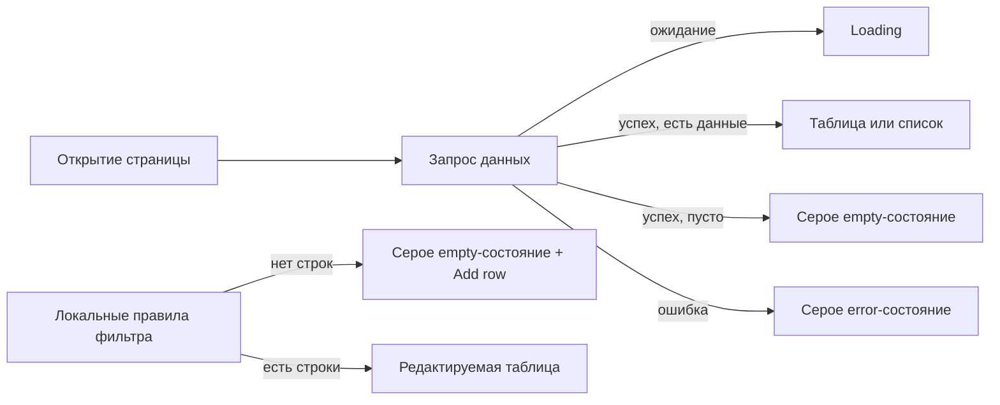

## Общая картина

Каждая страница списка сохраняет собственный запрос и разметку данных, но получает явное состояние загрузки: `loading`, `ready` или `error`. При `ready` непустые данные отображаются прежней таблицей/списком, пустые — локализованным серым сообщением по центру; при `error` список и устаревшие данные заменяются таким же сообщением об ошибке. Заголовок страницы и доступные действия находятся вне переключателя состояния.

На `/scripts/subscriptions` единое состояние начальной загрузки учитывает подписки, сценарии и события. В шторке этой страницы локальная коллекция правил meta-фильтра не имеет ошибочного состояния: при отсутствии закреплённого правила и пользовательских строк показывается пустое состояние, а кнопка добавления остаётся под ним.

Существующий семантический `h2` заголовка каждой шторки оформляется типографикой `h2` текущей темы без вложенного заголовка. Новые сообщения проходят через существующую локализацию соответствующего плагина; для демонстрационной страницы добавляются клиентский keyset и строки ресурсов плагина Tmp.

## Единообразие

- Образец: `ThinkingHome.Plugins.TelegramChatList.WebUi/frontend/chats.tsx`
- Новый модуль: —; новая capability описывает уже подключённый `ThinkingHome.Plugins.Tmp`.
- Места подключения образца: —; регистрация страниц и API не меняется.
- Исключения подключения: общий компонент и новый пакет не создаются по решению пользователя, поэтому wiring отсутствует.

Образец повторяется как простая страница «API → валидированный список → таблица/пустое состояние» с логированием и уведомлением ошибки. Отступления: Scripts загружает три набора данных и сводит их в одно состояние страницы; Tmp сохраняет демонстрационную отмену запроса; редактор meta-фильтра использует только локальное empty-состояние. Wiki не содержит отдельного дизайн-чеклиста, поэтому единообразие опирается на Evidence Pack, код образца и `project.conventions`.

## Контракты

- HTTP API, события и схемы ответов не меняются.
- Общая WebUi-оболочка и обработка `/favicon.ico` не меняются; сетевой 404 этого ресурса не относится к контрактам затронутых списков и шторок.
- UI-контракт пяти асинхронных списков задают требования «Состояния списков сценариев и подписок», «Состояния списка расписания», изменённые требования Telegram-чатов и «Состояния демонстрационного списка».
- UI-контракт локального редактора задаёт «Пустое состояние редактора meta-фильтра»: empty-сообщение занимает место коллекции, кнопка добавления остаётся доступной.
- UI-контракт шторок задают требования «Заголовок шторки подписки» и «Заголовок шторки записи расписания»: ровно один `h2`, сохраняющий роль названия диалога и получающий типографику `h2` текущей темы.
- Идентификаторы проверки — маршруты и названия сценариев из дельт; отдельные `data-testid` не вводятся, поскольку TypeScript-тест-раннера в проекте нет.

## Решения

### D1. Явное состояние асинхронной загрузки

- Решение: в каждом затронутом экране хранить статус `loading | ready | error` отдельно от данных; новый запрос переводит экран в `loading`, успех — в `ready`, неотменённая ошибка — в `error`. Ошибка очищает визуальное представление прежнего списка.
- Обоснование: `undefined` сейчас одновременно означает ожидание и ошибку, поэтому ошибку невозможно отобразить.
- Альтернативы: выводить ошибку только toast-уведомлением — не выполняет спецификации; выводить ошибку поверх старого списка — создаёт неоднозначность актуальности данных.
- Последствия: оболочка страницы и действия рендерятся всегда; таблица, empty и error взаимно исключают друг друга.
- promote: true

### D2. Локальная композиция состояний из Mantine

- Решение: в каждом месте собрать состояние из `Text` Mantine с `c="dimmed"`, `ta="center"` и одинаковым вертикальным отступом; общий React-компонент не создавать.
- Обоснование: соответствует решению пользователя и не требует отдельной поставки `@thinking-home/ui`.
- Альтернативы: общий компонент в репозитории или UI-пакете — отложен в отдельное изменение.
- Последствия: небольшое повторение разметки; постоянное правило в документации удерживает визуальное единообразие.
- promote: true

### D3. Empty-состояние редактора правил

- Решение: область списка правил отображается всегда; при отсутствии закреплённой и пользовательских строк вместо таблицы показывается empty-сообщение, а кнопка добавления остаётся снаружи переключателя.
- Обоснование: пользователь видит существование коллекции до добавления первой строки.
- Альтернативы: скрывать таблицу как сейчас — признано неясным; добавлять error-состояние — у локальной коллекции нет отдельной загрузки.
- Последствия: выбор пользовательского события или добавление строки заменяет сообщение таблицей без изменения данных формы.
- promote: true

### D4. Семантические заголовки шторок

- Решение: сохранить строковое значение `Drawer.title` и через `Drawer.styles.title` оформить уже создаваемый `DrawerTitle`: `fontFamily: var(--mantine-font-family-headings)`, `fontSize: var(--mantine-h2-font-size)`, `lineHeight: var(--mantine-h2-line-height)`, `fontWeight: var(--mantine-h2-font-weight)`.
- Обоснование: Mantine уже рендерит `DrawerTitle` как `h2`, присваивает ему `id` и связывает с диалогом через `aria-labelledby`; style API увеличивает его без второго заголовка и следует теме.
- Альтернативы: `Title order={2}` внутри `Drawer.title` создаёт невалидный вложенный `<h2><h2>`; числовые размеры дублируют параметры темы; строка без стилей остаётся мелкой.
- Последствия: обе шторки сохраняют единственный семантический заголовок и доступное имя диалога, получая одинаковую типографику `h2` без отдельного CSS.
- promote: true

### D5. Локализация и документирование правил

- Решение: переиспользовать существующие `emptyList`/`errorLoad`, добавить ключ пустого meta-фильтра и keyset для `/page2`; синхронно обновить английские и русские `.resx`. В `project.conventions` добавить раздел правил дизайна для списков и стилизации существующего заголовка шторок.
- Обоснование: все новые пользовательские тексты должны следовать действующему контракту локализации.
- Альтернативы: жёстко заданный английский текст на Tmp — противоречит соглашениям проекта.
- Последствия: документация закрепляет D1–D4 до появления общего компонента.
- promote: true

### D6. Явная отмена запроса на демонстрационной странице

- Решение: по утверждённому ответу Q1 отмена кнопкой завершает loading и показывает error-вариант с локализованным текстом «Загрузка отменена»; abort при размонтировании ничего не показывает.
- Обоснование: сохраняются две согласованные визуальные вариации и демонстрационная кнопка не оставляет страницу в вечном loading.
- Альтернативы: третье cancelled-состояние расширяет объём; считать отмену общей ошибкой даёт неверный текст; оставить loading — вводит в заблуждение.
- Последствия: источник отмены должен различаться до обработки `AbortError`.
- promote: false

### D7. Граница browser-проверки

- Решение: оценивать ошибки изменённых маршрутов и API; известный 404 `/favicon.ico`, не создаваемый затронутыми экранами, фиксировать как внешний шум без исправления в этом изменении.
- Обоснование: favicon относится к общей WebUi-оболочке и отсутствует в запросе и дельтах спецификаций; его исправление расширило бы утверждённый объём.
- Альтернативы: зарегистрировать favicon в этом изменении — потребует отдельного контракта и проверки общей оболочки; считать любой фоновый 404 регрессией — не различает ошибки изменения и окружения.
- Последствия: change-set остаётся ограничен пятью списками, редактором правил, двумя шторками, локализацией и документацией.
- promote: false

## Вопросы, требующие решения

—

## Соответствие правилам

- Правила пакета отсутствуют. `project.conventions`: React, Mantine и `@thinking-home/ui` остаются внешними для бандлов; ответы API продолжают валидироваться valibot; тексты идут через Keyset и `.resx`; `Resources/app/**` не коммитится.

## Риски и компромиссы

- Ошибка повторной загрузки может оставить старые данные визуально актуальными → D1 заменяет список error-состоянием.
- Три параллельных запроса страницы подписок могут породить несколько уведомлений → агрегировать начальную загрузку в один page-level outcome и одно уведомление.
- Локальная разметка может разойтись между плагинами → одинаковые Mantine props, сценарии спецификаций и правило в `project.conventions`.
- Автоматических UI-тестов нет → типизация каждого бандла, полная сборка и браузерная проверка всех сценариев.

## Стратегия проверки

- Структура контракта: `sbox-contract validate --delta openspec/changes/design-fixes/specs` и `sbox validate --change design-fixes`.
- TypeScript: `npx tsc -p tsconfig.json` в Scripts.WebUi, Cron.WebUi, TelegramChatList.WebUi и Tmp.
- Сборка: `dotnet build ThinkingHome.sln` с Node 24; при чистом дереве повторить после первого восстановления клиентских зависимостей.
- Браузер: для каждого маршрута проверить непустой, пустой и ошибочный ответ; отдельно empty→первая строка meta-фильтра и два источника abort `/page2`; повторить визуальные проверки в светлой и тёмной темах. Для обеих шторок проверить единственный `h2`, сохранённую связь `aria-labelledby` и вычисленные `font-size`, `line-height`, `font-weight` темы `h2`. Ошибки изменённых маршрутов и API блокируют поставку; известный 404 `/favicon.ico` учитывается по D7.

## Миграция и откат

Миграции данных и изменения API отсутствуют. Откат — вернуть клиентскую разметку, ключи локализации и раздел правил дизайна; серверные данные не затрагиваются.
